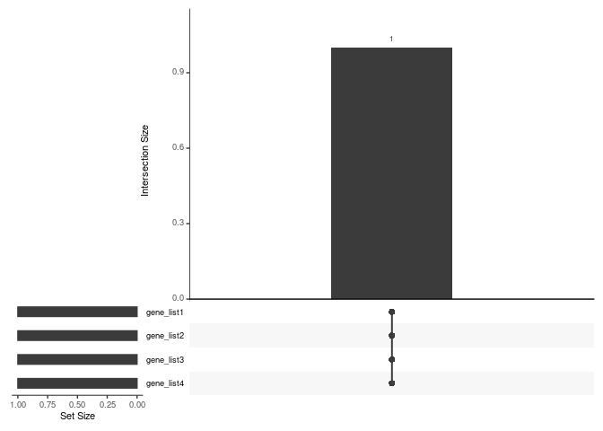
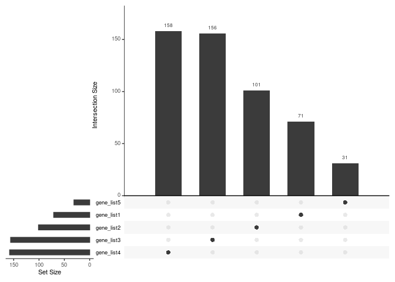
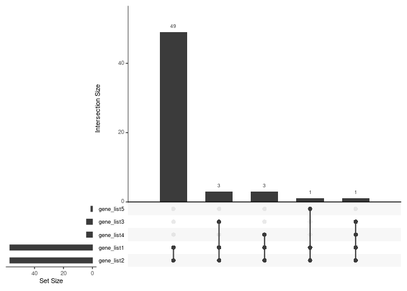
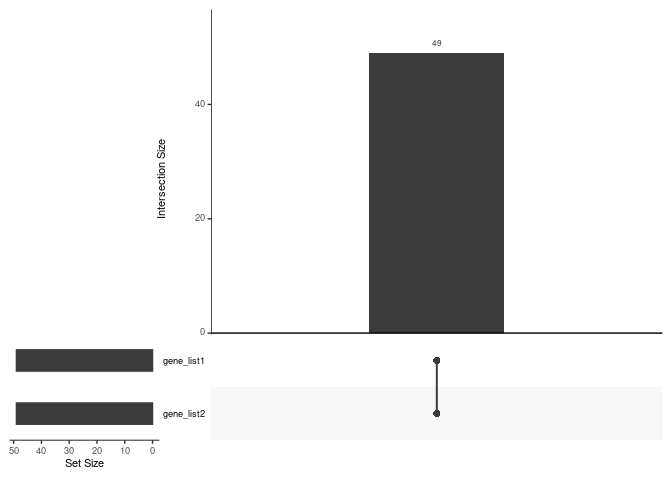

Extract Intersected Features
================
M, MARÇÃO
2024-08-04

``` r
library(dplyr)
library(UpSetR)
```

``` r
# Load example data
input_UpsetPlot <- readRDS("/mnt/scratch1/maycon/ToolBox/Intersect_features_Upsetplot/Objects/input_UpsetPlot.rds")
str(input_UpsetPlot)
```

    ## List of 5
    ##  $ gene_list1: chr [1:141] "ABCA1" "ABCB1" "ABCC2" "ABCG2" ...
    ##  $ gene_list2: chr [1:181] "ABCA1" "ABCB1" "ABCC2" "ABCG2" ...
    ##  $ gene_list3: chr [1:192] "ABCB11" "ABCC8" "ABCG5" "ACADS" ...
    ##  $ gene_list4: chr [1:203] "ABCA4" "ABCC6" "ACADVL" "ACOX1" ...
    ##  $ gene_list5: chr [1:47] "ABCC9" "ACAD9" "ACADS" "ACADSB" ...

``` r
# First glimpse at the data 
library(UpSetR)
upset(fromList(input_UpsetPlot), order.by = "freq", nsets = length(input_UpsetPlot)) 
```

<!-- -->

### 1. How to extract most overlapped features

``` r
x <- upset(fromList(input_UpsetPlot), nsets = 22)
x1 <- unlist(input_UpsetPlot, use.names = FALSE)
x1 <- x1[ !duplicated(x1) ]
# x and x1 have the their elements aligned 


df <- data.frame(table(rowSums(x$New_data)))
names(df) <-  c("intersected_lists", 
                             "intersected_features")
print(df)
```

    ##   intersected_lists intersected_features
    ## 1                 1                  517
    ## 2                 2                  105
    ## 3                 3                   11
    ## 4                 4                    1

``` r
# The most overlapped features occur across 4 of 5 lists and it's only one feature. 
# Here is this feature:
overlapped_features <- x1[ rowSums(x$New_data) == 4 ]
print(overlapped_features) # features in a vector
```

    ## [1] "CFTR"

``` r
# or 
filtered_list_1 <- lapply(input_UpsetPlot, function(x) x[x %in% overlapped_features]) # features in a list account for each of the lists they come from
print(filtered_list_1)
```

    ## $gene_list1
    ## [1] "CFTR"
    ## 
    ## $gene_list2
    ## [1] "CFTR"
    ## 
    ## $gene_list3
    ## [1] "CFTR"
    ## 
    ## $gene_list4
    ## [1] "CFTR"
    ## 
    ## $gene_list5
    ## character(0)

``` r
library(UpSetR)
upset(fromList(filtered_list_1), order.by = "freq", nsets = length(filtered_list_1)) 
```

<!-- -->

2.  How to extract exclusively features

``` r
exclusively_features <- x1[ rowSums(x$New_data) == 1 ]
print(exclusively_features) # features in a vector
```

    ##   [1] "GAPDH"     "GATA3"     "GJA1"      "GSTM1"     "GSTP1"     "HDAC1"    
    ##   [7] "HIF1A"     "HMOX1"     "HRAS"      "HSP90AA1"  "HSPA5"     "ICAM1"    
    ##  [13] "IGF1"      "IGF1R"     "IL1B"      "IL6"       "JAK2"      "JUN"      
    ##  [19] "KDR"       "LEP"       "MAP2K1"    "MAPK1"     "MAPK14"    "MAPK3"    
    ##  [25] "MAPK8"     "MCL1"      "MDM2"      "MET"       "MMP2"      "MMP9"     
    ##  [31] "MPO"       "MTOR"      "MYC"       "MYCN"      "NFE2L2"    "NFKB1"    
    ##  [37] "NOS2"      "NOS3"      "NOTCH1"    "NQO1"      "NR3C1"     "PARP1"    
    ##  [43] "PCNA"      "PIK3CA"    "PLAU"      "POLD1"     "PRKCA"     "PTGS2"    
    ##  [49] "RAC1"      "RAF1"      "RELA"      "RHOA"      "ROS1"      "RUNX2"    
    ##  [55] "SLC2A4"    "SMAD3"     "SOD1"      "SOD2"      "SRC"       "STAT1"    
    ##  [61] "STAT3"     "TERT"      "TIMP1"     "TNF"       "TNFRSF1A"  "TYMS"     
    ##  [67] "VCAM1"     "VEGFA"     "WNT1"      "XIAP"      "YAP1"      "ABL1"     
    ##  [73] "ADA"       "ADH1B"     "ADRA1A"    "ADRB1"     "AGT"       "AGTR1"    
    ##  [79] "AHR"       "AKR1C3"    "ALB"       "ALDH2"     "APOC3"     "ASAH1"    
    ##  [85] "ATF4"      "BCL2L1"    "BECN1"     "BMP2"      "CACNA1C"   "CALCA"    
    ##  [91] "CASP8"     "CCND1"     "CD40"      "CEBPA"     "CRP"       "CTNNB1"   
    ##  [97] "CYP11B2"   "CYP17A1"   "CYP19A1"   "DRD2"      "EDN1"      "ELK1"     
    ## [103] "EPO"       "ERCC1"     "F7"        "FGF1"      "FLT1"      "FN1"      
    ## [109] "FOLR1"     "G6PD"      "GCG"       "GH1"       "GHR"       "GLI1"     
    ## [115] "GRB2"      "GSK3B"     "GSTT1"     "HGF"       "HMGCR"     "HSPB1"    
    ## [121] "HTR2A"     "IFNG"      "IL10"      "IL2"       "IL4"       "IRS1"     
    ## [127] "ITGAV"     "JAK1"      "KLK3"      "LDL"       "MAOA"      "MAOB"     
    ## [133] "MDR1"      "MMP1"      "MT-CO1"    "MTHFR"     "NFKBIA"    "NR1H3"    
    ## [139] "NR1I2"     "NR1I3"     "OLR1"      "OPRM1"     "P2RY12"    "PGR"      
    ## [145] "PLAT"      "PRKAA1"    "PRKCB"     "PRNP"      "PROC"      "PTGDR"    
    ## [151] "PTGER4"    "PTGS1"     "RARA"      "RASSF1"    "REN"       "RETN"     
    ## [157] "S100B"     "SELE"      "SERPINE1"  "SLC6A4"    "SMPD1"     "SPP1"     
    ## [163] "SULT1A1"   "TAP1"      "THBD"      "THPO"      "TLR4"      "TNFSF11"  
    ## [169] "TPH1"      "TTR"       "VKORC1"    "VWF"       "ABCB11"    "ABCC8"    
    ## [175] "ABCG5"     "ACE2"      "ACLY"      "ACTN1"     "ADCY1"     "ADIPOQ"   
    ## [181] "ADRA2A"    "AGL"       "AHSG"      "AKR1D1"    "ANGPT1"    "ANGPT2"   
    ## [187] "ANGPTL3"   "ANPEP"     "APOA1"     "APOA2"     "APOA4"     "APOC1"    
    ## [193] "APOC2"     "AQP1"      "AQP2"      "ARG1"      "ASXL1"     "ATP7B"    
    ## [199] "BAAT"      "BCKDHA"    "BCKDHB"    "BMP4"      "BMP7"      "C3"       
    ## [205] "CA2"       "CASR"      "CCK"       "CCKAR"     "CD36"      "CDH5"     
    ## [211] "CETP"      "CFB"       "CFH"       "CXCL12"    "CYP11A1"   "CYP11B1"  
    ## [217] "CYP24A1"   "CYP27B1"   "CYP2E1"    "CYP7A1"    "DAG1"      "DGAT1"    
    ## [223] "DGAT2"     "DIO1"      "DIO2"      "DPP4"      "EHHADH"    "ELANE"    
    ## [229] "ELOVL6"    "ENPP1"     "F10"       "F11"       "F12"       "F13A1"    
    ## [235] "F5"        "FABP1"     "FABP2"     "FADS1"     "FADS2"     "FBP1"     
    ## [241] "FFAR1"     "FGA"       "FGB"       "FGG"       "FKBP1A"    "FOXO1"    
    ## [247] "G6PC"      "GAA"       "GATA4"     "GCK"       "GIP"       "GLUL"     
    ## [253] "GNMT"      "GPT"       "HADHB"     "HFE"       "HGD"       "HMGCS2"   
    ## [259] "HNF4A"     "HPD"       "HSD11B1"   "HSD17B3"   "IFNB1"     "IGFBP1"   
    ## [265] "IGFBP3"    "IL1RN"     "ITIH4"     "KHK"       "KLF11"     "KNG1"     
    ## [271] "LCAT"      "LIPA"      "LIPC"      "LIPE"      "LPA"       "LPIN1"    
    ## [277] "LRP1"      "LRPAP1"    "LSS"       "LYZ"       "MGAM"      "MLXIPL"   
    ## [283] "MMP13"     "MTTP"      "MYBPC3"    "NPC1L1"    "NR0B2"     "NR1H4"    
    ## [289] "NR5A2"     "OTC"       "PANK1"     "PARP2"     "PCK1"      "PCK2"     
    ## [295] "PDK4"      "PDX1"      "PEMT"      "PGC1A"     "PKLR"      "PLIN1"    
    ## [301] "PNPLA2"    "PNPLA3"    "PRKAA2"    "PRSS1"     "RBP4"      "SCARB1"   
    ## [307] "SERPINA1"  "SERPINC1"  "SLC10A1"   "SLC10A2"   "SLC16A1"   "SLC22A1"  
    ## [313] "SLC25A13"  "SLC2A2"    "SLC30A8"   "SLC5A1"    "SLC6A19"   "SORD"     
    ## [319] "SREBF1"    "SREBF2"    "TAT"       "TCF7L2"    "TNFRSF11B" "UCP1"     
    ## [325] "UCP2"      "UCP3"      "UGT1A1"    "VDR"       "ABCA4"     "ABCC6"    
    ## [331] "ACTN4"     "ACVR1"     "ADGRG6"    "AIRE"      "AMH"       "ANOS1"    
    ## [337] "ANTXR2"    "ASPM"      "ATP2C1"    "ATP6V0A4"  "ATP7A"     "ATRX"     
    ## [343] "AXIN2"     "BBS1"      "BBS10"     "BEST1"     "BLM"       "BMPR1A"   
    ## [349] "BRAF"      "BRCA2"     "BRIP1"     "BTK"       "CACNA1A"   "CACNA1S"  
    ## [355] "CAPN3"     "CC2D2A"    "CDH23"     "CDKN2A"    "CHD7"      "CLCN1"    
    ## [361] "CLCN5"     "CLCNKB"    "COL1A2"    "COL2A1"    "COL3A1"    "COL4A5"   
    ## [367] "COL6A1"    "COL6A2"    "COL6A3"    "COL7A1"    "CRYAB"     "CTNS"     
    ## [373] "CYBB"      "CYP27A1"   "DBT"       "DCLRE1C"   "DMD"       "DNAH5"    
    ## [379] "DNAI1"     "DSP"       "DYSF"      "EDA"       "EDAR"      "EFNB1"    
    ## [385] "EGR2"      "EIF2AK3"   "ELN"       "EMD"       "ENG"       "ERCC2"    
    ## [391] "EVC"       "EXT1"      "F9"        "FAH"       "FANCA"     "FANCC"    
    ## [397] "FGFR2"     "FGFR3"     "FH"        "FLCN"      "FMR1"      "FOXC1"    
    ## [403] "FOXP3"     "FRAS1"     "FREM2"     "FUS"       "FXN"       "GALT"     
    ## [409] "GCH1"      "GDF5"      "GLA"       "GLI3"      "GNPTAB"    "GPC3"     
    ## [415] "HGSNAT"    "HR"        "IDS"       "IL2RG"     "ITGA2B"    "JAG1"     
    ## [421] "JAK3"      "KCNQ1"     "L1CAM"     "LAMA2"     "LAMB2"     "LAMP2"    
    ## [427] "LARGE1"    "LDB3"      "LRRK2"     "MECP2"     "MEN1"      "MERTK"    
    ## [433] "MSH6"      "MTM1"      "MUTYH"     "MYO7A"     "NAGLU"     "NBN"      
    ## [439] "NF1"       "NPHP1"     "NSD1"      "OCA2"      "PAH"       "PARK2"    
    ## [445] "PCDH15"    "PEX1"      "PHEX"      "PKD1"      "PKD2"      "PLP1"     
    ## [451] "PMM2"      "PRKAG2"    "PROM1"     "PRPF31"    "RAB27A"    "RAG1"     
    ## [457] "RAG2"      "ROR2"      "RP2"       "RPE65"     "RYR1"      "SCN4A"    
    ## [463] "SDHB"      "SGCE"      "SH3BP2"    "SLC12A3"   "SLC26A4"   "SLC3A1"   
    ## [469] "SLC4A1"    "SLC7A9"    "SMAD4"     "SMN1"      "SPINK1"    "SPRED1"   
    ## [475] "STK11"     "TGFBI"     "TGFBR2"    "TNFRSF11A" "TNNI3"     "TSC1"     
    ## [481] "TSC2"      "TTN"       "TYR"       "USH2A"     "WAS"       "WT1"      
    ## [487] "ABCC9"     "ACAD9"     "ACADSB"    "ACTC1"     "ACTN2"     "ACVR2B"   
    ## [493] "ADCK3"     "ADGRV1"    "AFF2"      "AGA"       "AGXT"      "AIPL1"    
    ## [499] "ALDH18A1"  "ALDH4A1"   "ALDH5A1"   "ALDH7A1"   "ALG1"      "ALG12"    
    ## [505] "ALG3"      "ALG6"      "ALG8"      "AMT"       "ANO5"      "AP3B1"    
    ## [511] "ARSE"      "ASL"       "ASPA"      "ASS1"      "ATP13A2"   "ATP6V0A2" 
    ## [517] "ATP6V1B1"

``` r
# or 
filtered_list_2 <- lapply(input_UpsetPlot, function(x) x[x %in% exclusively_features]) # features in a list account for each of the lists they come from
print(filtered_list_2)
```

    ## $gene_list1
    ##  [1] "GAPDH"    "GATA3"    "GJA1"     "GSTM1"    "GSTP1"    "HDAC1"   
    ##  [7] "HIF1A"    "HMOX1"    "HRAS"     "HSP90AA1" "HSPA5"    "ICAM1"   
    ## [13] "IGF1"     "IGF1R"    "IL1B"     "IL6"      "JAK2"     "JUN"     
    ## [19] "KDR"      "LEP"      "MAP2K1"   "MAPK1"    "MAPK14"   "MAPK3"   
    ## [25] "MAPK8"    "MCL1"     "MDM2"     "MET"      "MMP2"     "MMP9"    
    ## [31] "MPO"      "MTOR"     "MYC"      "MYCN"     "NFE2L2"   "NFKB1"   
    ## [37] "NOS2"     "NOS3"     "NOTCH1"   "NQO1"     "NR3C1"    "PARP1"   
    ## [43] "PCNA"     "PIK3CA"   "PLAU"     "POLD1"    "PRKCA"    "PTGS2"   
    ## [49] "RAC1"     "RAF1"     "RELA"     "RHOA"     "ROS1"     "RUNX2"   
    ## [55] "SLC2A4"   "SMAD3"    "SOD1"     "SOD2"     "SRC"      "STAT1"   
    ## [61] "STAT3"    "TERT"     "TIMP1"    "TNF"      "TNFRSF1A" "TYMS"    
    ## [67] "VCAM1"    "VEGFA"    "WNT1"     "XIAP"     "YAP1"    
    ## 
    ## $gene_list2
    ##   [1] "ABL1"     "ADA"      "ADH1B"    "ADRA1A"   "ADRB1"    "AGT"     
    ##   [7] "AGTR1"    "AHR"      "AKR1C3"   "ALB"      "ALDH2"    "APOC3"   
    ##  [13] "ASAH1"    "ATF4"     "BCL2L1"   "BECN1"    "BMP2"     "CACNA1C" 
    ##  [19] "CALCA"    "CASP8"    "CCND1"    "CD40"     "CEBPA"    "CRP"     
    ##  [25] "CTNNB1"   "CYP11B2"  "CYP17A1"  "CYP19A1"  "DRD2"     "EDN1"    
    ##  [31] "ELK1"     "EPO"      "ERCC1"    "F7"       "FGF1"     "FLT1"    
    ##  [37] "FN1"      "FOLR1"    "G6PD"     "GCG"      "GH1"      "GHR"     
    ##  [43] "GLI1"     "GRB2"     "GSK3B"    "GSTT1"    "HGF"      "HMGCR"   
    ##  [49] "HSPB1"    "HTR2A"    "IFNG"     "IL10"     "IL2"      "IL4"     
    ##  [55] "IRS1"     "ITGAV"    "JAK1"     "KLK3"     "LDL"      "MAOA"    
    ##  [61] "MAOB"     "MDR1"     "MMP1"     "MT-CO1"   "MTHFR"    "NFKBIA"  
    ##  [67] "NR1H3"    "NR1I2"    "NR1I3"    "OLR1"     "OPRM1"    "P2RY12"  
    ##  [73] "PGR"      "PLAT"     "PRKAA1"   "PRKCB"    "PRNP"     "PROC"    
    ##  [79] "PTGDR"    "PTGER4"   "PTGS1"    "RARA"     "RASSF1"   "REN"     
    ##  [85] "RETN"     "S100B"    "SELE"     "SERPINE1" "SLC6A4"   "SMPD1"   
    ##  [91] "SPP1"     "SULT1A1"  "TAP1"     "THBD"     "THPO"     "TLR4"    
    ##  [97] "TNFSF11"  "TPH1"     "TTR"      "VKORC1"   "VWF"     
    ## 
    ## $gene_list3
    ##   [1] "ABCB11"    "ABCC8"     "ABCG5"     "ACE2"      "ACLY"      "ACTN1"    
    ##   [7] "ADCY1"     "ADIPOQ"    "ADRA2A"    "AGL"       "AHSG"      "AKR1D1"   
    ##  [13] "ANGPT1"    "ANGPT2"    "ANGPTL3"   "ANPEP"     "APOA1"     "APOA2"    
    ##  [19] "APOA4"     "APOC1"     "APOC2"     "AQP1"      "AQP2"      "ARG1"     
    ##  [25] "ASXL1"     "ATP7B"     "BAAT"      "BCKDHA"    "BCKDHB"    "BMP4"     
    ##  [31] "BMP7"      "C3"        "CA2"       "CASR"      "CCK"       "CCKAR"    
    ##  [37] "CD36"      "CDH5"      "CETP"      "CFB"       "CFH"       "CXCL12"   
    ##  [43] "CYP11A1"   "CYP11B1"   "CYP24A1"   "CYP27B1"   "CYP2E1"    "CYP7A1"   
    ##  [49] "DAG1"      "DGAT1"     "DGAT2"     "DIO1"      "DIO2"      "DPP4"     
    ##  [55] "EHHADH"    "ELANE"     "ELOVL6"    "ENPP1"     "F10"       "F11"      
    ##  [61] "F12"       "F13A1"     "F5"        "FABP1"     "FABP2"     "FADS1"    
    ##  [67] "FADS2"     "FBP1"      "FFAR1"     "FGA"       "FGB"       "FGG"      
    ##  [73] "FKBP1A"    "FOXO1"     "G6PC"      "GAA"       "GATA4"     "GCK"      
    ##  [79] "GIP"       "GLUL"      "GNMT"      "GPT"       "HADHB"     "HFE"      
    ##  [85] "HGD"       "HMGCS2"    "HNF4A"     "HPD"       "HSD11B1"   "HSD17B3"  
    ##  [91] "IFNB1"     "IGFBP1"    "IGFBP3"    "IL1RN"     "ITIH4"     "KHK"      
    ##  [97] "KLF11"     "KNG1"      "LCAT"      "LIPA"      "LIPC"      "LIPE"     
    ## [103] "LPA"       "LPIN1"     "LRP1"      "LRPAP1"    "LSS"       "LYZ"      
    ## [109] "MGAM"      "MLXIPL"    "MMP13"     "MTTP"      "MYBPC3"    "NPC1L1"   
    ## [115] "NR0B2"     "NR1H4"     "NR5A2"     "OTC"       "PANK1"     "PARP2"    
    ## [121] "PCK1"      "PCK2"      "PDK4"      "PDX1"      "PEMT"      "PGC1A"    
    ## [127] "PKLR"      "PLIN1"     "PNPLA2"    "PNPLA3"    "PRKAA2"    "PRSS1"    
    ## [133] "RBP4"      "SCARB1"    "SERPINA1"  "SERPINC1"  "SLC10A1"   "SLC10A2"  
    ## [139] "SLC16A1"   "SLC22A1"   "SLC25A13"  "SLC2A2"    "SLC30A8"   "SLC5A1"   
    ## [145] "SLC6A19"   "SORD"      "SREBF1"    "SREBF2"    "TAT"       "TCF7L2"   
    ## [151] "TNFRSF11B" "UCP1"      "UCP2"      "UCP3"      "UGT1A1"    "VDR"      
    ## 
    ## $gene_list4
    ##   [1] "ABCA4"     "ABCC6"     "ACTN4"     "ACVR1"     "ADGRG6"    "AIRE"     
    ##   [7] "AMH"       "ANOS1"     "ANTXR2"    "ASPM"      "ATP2C1"    "ATP6V0A4" 
    ##  [13] "ATP7A"     "ATRX"      "AXIN2"     "BBS1"      "BBS10"     "BEST1"    
    ##  [19] "BLM"       "BMPR1A"    "BRAF"      "BRCA2"     "BRIP1"     "BTK"      
    ##  [25] "CACNA1A"   "CACNA1S"   "CAPN3"     "CC2D2A"    "CDH23"     "CDKN2A"   
    ##  [31] "CHD7"      "CLCN1"     "CLCN5"     "CLCNKB"    "COL1A2"    "COL2A1"   
    ##  [37] "COL3A1"    "COL4A5"    "COL6A1"    "COL6A2"    "COL6A3"    "COL7A1"   
    ##  [43] "CRYAB"     "CTNS"      "CYBB"      "CYP27A1"   "DBT"       "DCLRE1C"  
    ##  [49] "DMD"       "DNAH5"     "DNAI1"     "DSP"       "DYSF"      "EDA"      
    ##  [55] "EDAR"      "EFNB1"     "EGR2"      "EIF2AK3"   "ELN"       "EMD"      
    ##  [61] "ENG"       "ERCC2"     "EVC"       "EXT1"      "F9"        "FAH"      
    ##  [67] "FANCA"     "FANCC"     "FGFR2"     "FGFR3"     "FH"        "FLCN"     
    ##  [73] "FMR1"      "FOXC1"     "FOXP3"     "FRAS1"     "FREM2"     "FUS"      
    ##  [79] "FXN"       "GALT"      "GCH1"      "GDF5"      "GLA"       "GLI3"     
    ##  [85] "GNPTAB"    "GPC3"      "HGSNAT"    "HR"        "IDS"       "IL2RG"    
    ##  [91] "ITGA2B"    "JAG1"      "JAK3"      "KCNQ1"     "L1CAM"     "LAMA2"    
    ##  [97] "LAMB2"     "LAMP2"     "LARGE1"    "LDB3"      "LRRK2"     "MECP2"    
    ## [103] "MEN1"      "MERTK"     "MSH6"      "MTM1"      "MUTYH"     "MYO7A"    
    ## [109] "NAGLU"     "NBN"       "NF1"       "NPHP1"     "NSD1"      "OCA2"     
    ## [115] "PAH"       "PARK2"     "PCDH15"    "PEX1"      "PHEX"      "PKD1"     
    ## [121] "PKD2"      "PLP1"      "PMM2"      "PRKAG2"    "PROM1"     "PRPF31"   
    ## [127] "RAB27A"    "RAG1"      "RAG2"      "ROR2"      "RP2"       "RPE65"    
    ## [133] "RYR1"      "SCN4A"     "SDHB"      "SGCE"      "SH3BP2"    "SLC12A3"  
    ## [139] "SLC26A4"   "SLC3A1"    "SLC4A1"    "SLC7A9"    "SMAD4"     "SMN1"     
    ## [145] "SPINK1"    "SPRED1"    "STK11"     "TGFBI"     "TGFBR2"    "TNFRSF11A"
    ## [151] "TNNI3"     "TSC1"      "TSC2"      "TTN"       "TYR"       "USH2A"    
    ## [157] "WAS"       "WT1"      
    ## 
    ## $gene_list5
    ##  [1] "ABCC9"    "ACAD9"    "ACADSB"   "ACTC1"    "ACTN2"    "ACVR2B"  
    ##  [7] "ADCK3"    "ADGRV1"   "AFF2"     "AGA"      "AGXT"     "AIPL1"   
    ## [13] "ALDH18A1" "ALDH4A1"  "ALDH5A1"  "ALDH7A1"  "ALG1"     "ALG12"   
    ## [19] "ALG3"     "ALG6"     "ALG8"     "AMT"      "ANO5"     "AP3B1"   
    ## [25] "ARSE"     "ASL"      "ASPA"     "ASS1"     "ATP13A2"  "ATP6V0A2"
    ## [31] "ATP6V1B1"

``` r
library(UpSetR)
upset(fromList(filtered_list_2), order.by = "freq", nsets = length(filtered_list_2)) 
```

    ## `geom_line()`: Each group consists of only one observation.
    ## ℹ Do you need to adjust the group aesthetic?

<!-- -->

3.  How to extract from a given intersection

``` r
# Get features intersect ONLY within gene_list1 and gene_list2
list1_list2_overlapped_features <- x1[ rowSums(x$New_data[, c("gene_list1", "gene_list2")]) == 2 ]
filtered_list_3 <- lapply(input_UpsetPlot, function(x) x[x %in% list1_list2_overlapped_features]) # features in a list account for each of the lists they come from

# From list 1 and 2, remove features that happen to appear within the other lists 
list1_list2 <- unique(as.vector(unlist(filtered_list_3[c(1,2)])))
other_lists <- unique(as.vector(unlist(filtered_list_3[c(3,4,5)])))

real_list1_list2_overlapped_features <- list1_list2[!list1_list2 %in% other_lists]
print(real_list1_list2_overlapped_features)
```

    ##  [1] "ABCA1"   "ABCB1"   "ABCC2"   "ABCG2"   "ACACA"   "ACHE"    "ACSL1"  
    ##  [8] "ACTB"    "ADAM10"  "ADAM17"  "ADRB2"   "AKT1"    "ALDH1A1" "ALOX5"  
    ## [15] "ANXA1"   "APP"     "AR"      "AREG"    "ATP1A1"  "BAX"     "BCL2"   
    ## [22] "BDNF"    "BIRC5"   "BRCA1"   "CASP3"   "CAT"     "CCL2"    "CCR5"   
    ## [29] "CD34"    "CD44"    "CDH1"    "CDK2"    "CDKN1A"  "CYP1A1"  "CYP2C19"
    ## [36] "CYP2D6"  "CYP3A4"  "DDIT3"   "DNMT1"   "EGFR"    "EGR1"    "ERBB2"  
    ## [43] "ESR1"    "F2"      "FAS"     "FASLG"   "FGF2"    "FOS"     "FOXO3"

``` r
filtered_list_4 <- lapply(input_UpsetPlot, function(x) x[x %in% real_list1_list2_overlapped_features])

# With only the usual filtering 
library(UpSetR)
upset(fromList(filtered_list_3), order.by = "freq", nsets = length(filtered_list_3))
```

<!-- -->

``` r
# Final filtering 
library(UpSetR)
upset(fromList(filtered_list_4), order.by = "freq", nsets = length(filtered_list_4))
```

<!-- -->

### END.
